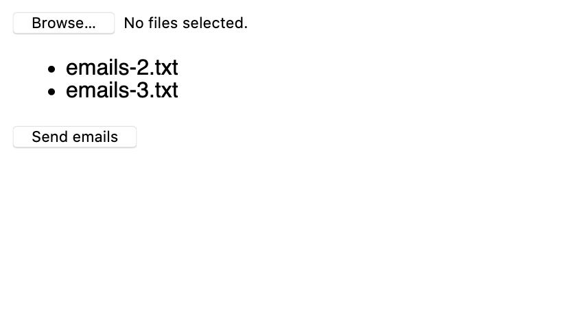
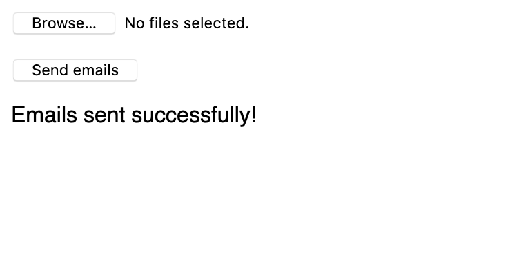
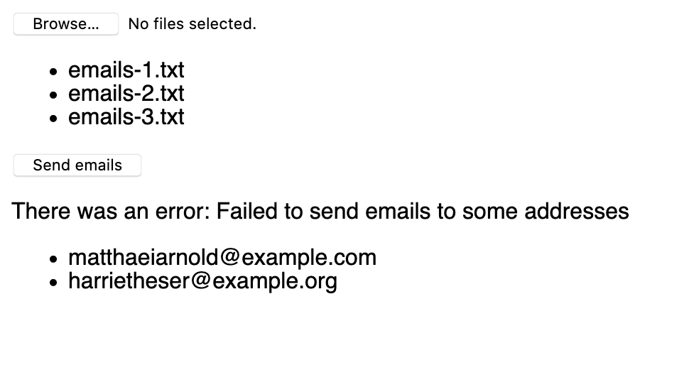

# Toggl Hire Frontend Developer Homework

The goal of this assignment is to see how familiar you are with JavaScript, React and web technologies. We tried to pick a task that is similar to what you would do at Toggl Hire, while keeping it minimal so you can finish it in a short time.

We have a simple service used for sending emails to many candidates at once. The service has a single API endpoint, which accepts a list of email addresses. The API is hosted on https://toggl-hire-frontend-homework.onrender.com, where you can also find the documentation. The implementation is also in the `backend` folder if you want to see the details, but you are not expected to do any changes here.

Your task is to implement a simple React application that will let the user select text files containing email addresses, read the files and send the email addresses to the API. The files have one email address per line. You can find some files for testing in the `data` directory.

Try to have as few dependencies for your application as possible, ideally use only React. You don't need to worry about support for older browsers for this assignment, but it should work in all major modern browsers (Chrome, Firefox, Edge, Safari). The code should be formatted with [Prettier](https://prettier.io).

There is a basic app created with Create React App in the `frontend` folder. Feel free to use it, or swap it for your favourite project setup.

Create a new repository on GitHub. You can [use this one as a template](https://github.com/togglhire/frontend-homework/generate). Commit your solution to your repository and send us a link to it. If you prefer having the repository private, please add one of our team members as a collaborator, so we can review it.

## Basic requirements

Your solution should meet all these requirements.

- [ ] Allow the user to select multiple `.txt` files with email addresses in them
- [ ] List all selected files together with their filenames
- [ ] When the form is submitted, read all selected files and parse the email addresses
- [ ] Send the list of email addresses to the provided API endpoint
- [ ] If the emails were sent successfully, reset the form and show a success message
- [ ] If the sending fails, show an error message and all email addresses which failed

## Bonus requirements

These requirements are not required, but feel free to complete some of them if they seem interesting, or to come up with your own :)

- [ ] Show a loading state while the request is in progress
- [ ] Allow drag & dropping files
- [ ] Show the number of email addresses in each selected file before the form is sent

## Screenshots from a basic solution

These screenshots are only to illustrate what the interface should look like, not as a design you have to follow. Feel free to add some nice styles :)

### Selecting files

### Success message

### Error message

